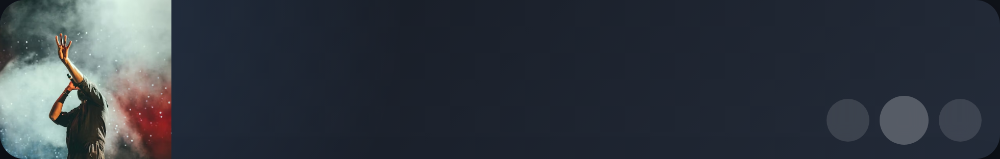
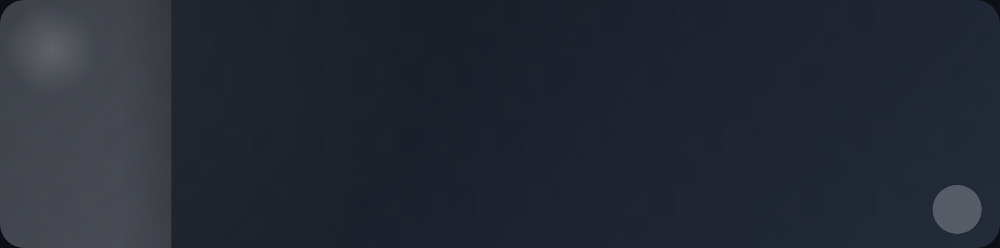

# Luxe Media Card

Elegant now-playing Lovelace card for Home Assistant with artwork, metadata, and transport controls in a wide layout.

## Features

- HACS-installable custom card
- Single `media_player` entity per card
- Artwork on the left, metadata and controls on the right
- Title and artist text left-aligned
- Play/pause button always shown
- Previous/next buttons shown only when enabled **and** supported by the device
- Height presets: `flat`, `compact`, `comfortable`, `tall`
- GUI editor for entity, height, and skip controls
- Local demo preview for quick visual regression checks

## Preview

### Playing / compact



### Paused / tall



## Install with HACS

1. Open **HACS → Frontend**.
2. Add this repository as a **custom repository**.
3. Install **Luxe Media Card**.
4. Reload Home Assistant.
5. Add the card from the Lovelace card picker.

## Manual install

1. Copy `dist/luxe-media-card.js` to your Home Assistant `www/` folder.
2. Add `/local/luxe-media-card.js` as a Lovelace resource.
3. Reload the browser.

## Example configuration

```yaml
type: custom:luxe-media-card
entity: media_player.living_room
height: compact
show_skip_controls: true
```

## Options

| Option | Type | Required | Default | Description |
|---|---|---:|---|---|
| `entity` | string | yes | - | Target `media_player` entity |
| `height` | `flat` \| `compact` \| `comfortable` \| `tall` | no | `compact` | Visual height preset |
| `show_skip_controls` | boolean | no | `true` | Allow previous/next buttons when supported |

## Behaviour notes

- If playback artwork is missing, the card shows a styled placeholder.
- If title/artist metadata is missing, the card falls back to the entity name and state.
- Skip buttons hide automatically when the selected player does not support them.
- The main transport button toggles play/pause depending on the player state.

## Development

```bash
npm install
npm test
npm run check
npm run build
npm run dev:demo
```

## Quality

The project is set up test-first and currently includes:

- config normalization and validation tests
- control support logic tests
- rendering tests for active, paused, fallback, and missing-entity states
- interaction tests for transport service calls
- GUI editor tests for entity filtering and config updates
- snapshot-style structure sanity checks for visual regressions

## Release flow

- Push normally to run CI
- Create a tag like `v0.1.0` to trigger the release workflow
- The release workflow attaches the built JS bundle and key metadata files

## Local visual demo

A small demo app lives in `demo/` so the card can be checked visually without a full Home Assistant instance.
